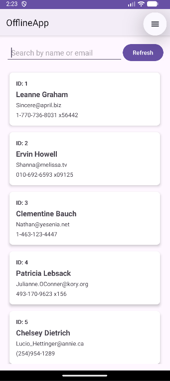
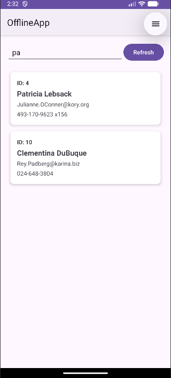
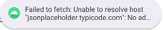

# OfflineApp - User Directory

## App Overview
A simple Android application that fetches user data from the JSONPlaceholder API and displays it in a list format. 
The app implements offline-first architecture, allowing users to view cached data even without an internet connection. 
Users can search through the list by name or email, and manually refresh the data using a refresh button.

## Screenshots

## Tech Used
- **Language:** Kotlin
- **Database:** Room (SQLite)
- **Networking:** Retrofit + Gson
- **Architecture:** MVVM with Repository Pattern
- **Async:** Coroutines + Flow
- **UI:** XML Layouts with RecyclerView

